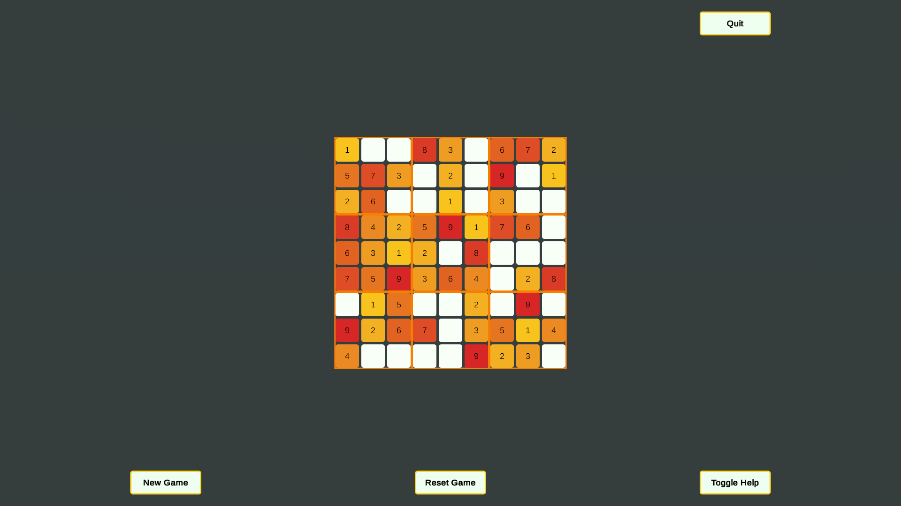
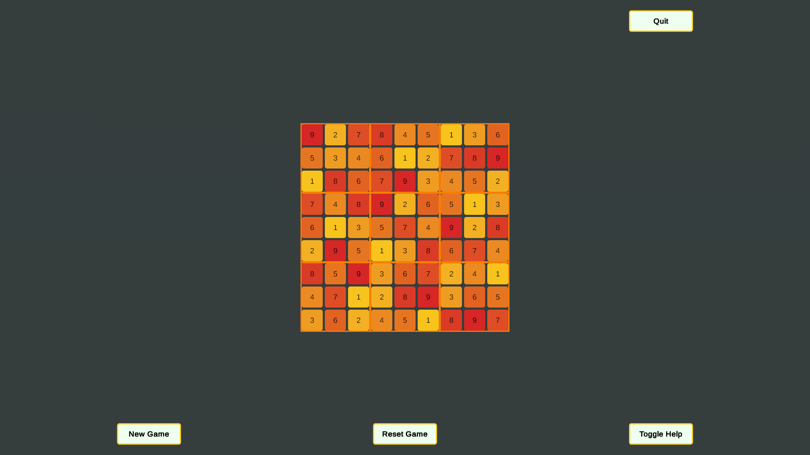
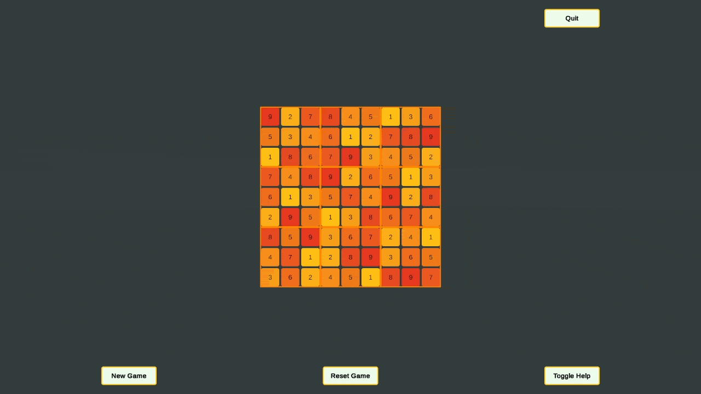

# Sudoku

This is a Sudoku generator as well as a game board. Within the editor you can generate keys for valid boards then in playmode the game selects on of the valid keys you're generated and makes a playable board from it.

Made it for fun to try my hand at NP completeness problems. Turns out I'm no genius who can find a clever solution on my first try.

### Game Preview

### New Board Preview

### Solving Preview

### Toggle Help Preview

