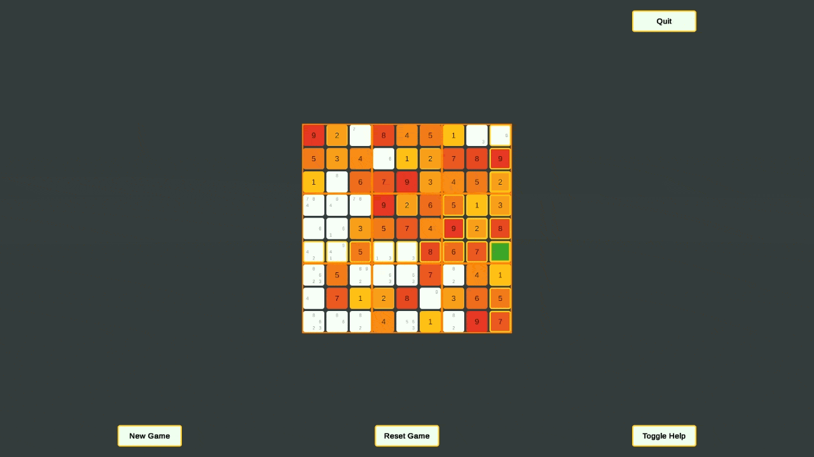
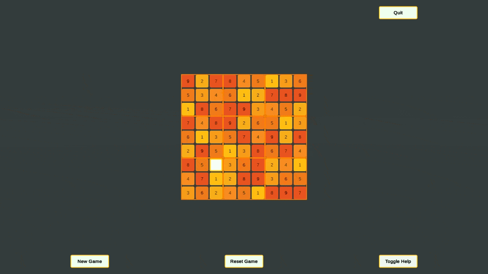

# Sudoku

This is a Sudoku generator as well as a game board. Within the editor you can generate keys for valid boards then in playmode the game selects one of the valid keys you've generated and makes a playable board from it.

Made it for fun and to try my hand at NP completeness problems. Turns out I'm not a genius who can find a clever solution on my first try. This is mostly brute force with a mindful approach to the data structures used.

### Game Preview

### New Board Preview

### Solving Preview

### Solved Preview

### Toggle Help Preview

